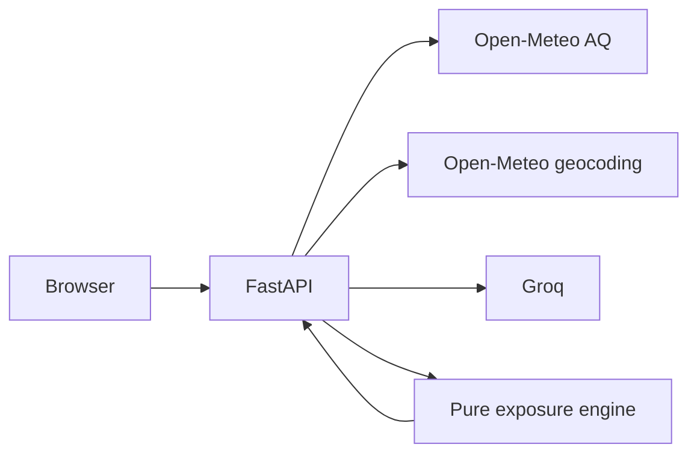

# Architecture

```mermaid
flowchart LR
  Browser --> API[FastAPI]
  API --> AQ[Open-Meteo AQ]
  API --> GEO[Open-Meteo geocoding]
  API --> Groq
  API --> Engine[Pure exposure engine]
  Engine --> API
```

The browser stores only family preferences and language. The server does not persist personal or health data. Groq receives data-only prompts and never receives tools or actions.
